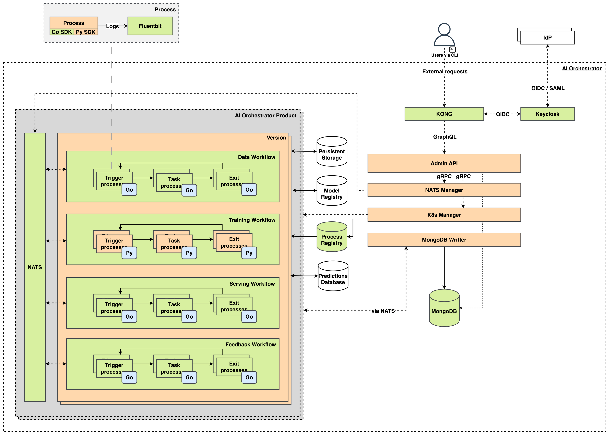

- [KAI (Konstellation AI)](#kai-konstellation-runtime-engine)
  - [Engine](#engine)
- [Architecture](#architecture)
  - [Engine](#engine-1)
  - [Runtime](#runtime-1)
    - [KRT](#krt)
- [Install](#install)
- [Development](#development)
  - [Requirements](#requirements)
  - [Basic usage](#basic-usage)
  - [Local Environment](#local-environment)
  - [Versioning lifecycle](#Versioning-lifecycle)
    - [Alphas](#Alphas)
    - [Releases](#Releases)
    - [Fixes](#Fixes)

# KAI (Konstellation AI)

Konstellation AI is a platform to manage the lifecycle of AI solutions.

## Engine

|  Component  | Coverage  |  Bugs  |  Maintainability Rating  |  Go report  |
| :---------: | :-----:   |  :---: |  :--------------------:  |  :---: |
|  Admin API  | [![coverage][admin-api-coverage]][admin-api-coverage-link] | [![bugs][admin-api-bugs]][admin-api-bugs-link] | [![mr][admin-api-mr]][admin-api-mr-link] | [![report][admin-api-report-badge]][admin-api-report-link] |
|  K8s Manager | [![coverage][k8s-manager-coverage]][k8s-manager-coverage-link] | [![bugs][k8s-manager-bugs]][k8s-manager-bugs-link] | [![mr][k8s-manager-mr]][k8s-manager-mr-link] | [![report][k8s-manager-report-badge]][k8s-manager-report-badge] |
|  NATS Manager | [![coverage][nats-manager-coverage]][nats-manager-coverage-link] | [![bugs][nats-manager-bugs]][nats-manager-bugs-link] | [![mr][nats-manager-mr]][nats-manager-mr-link] | [![report][nats-manager-report-badge]][nats-manager-report-badge] |

# Helm Chart

Refer to chart's [README](helm/kai/README.md).

# Architecture

KAI design is based on a microservice pattern to be run on top of a Kubernetes cluster.

The following diagram shows the main components and how they relate with each other.

 

Below are described the main concepts of KAI.

## Engine

Before installing KAI an already existing Kubernetes namespace is required. It will be named `kai` by convention, but
feel free to use whatever you like. The installation process will deploy some components that are responsible of
managing the full lifecycle of this AI solution.

The Engine is composed of the following components:

* [Admin API](engine/admin-api/README.md)
* [K8s Manager](engine/k8s-manager/README.md)
* MongoDB
* NATS-Streaming

### KRT

_Konstellation Runtime Transport_ file is a yaml file describing the desired workflows definitions.

The generic structure of a `krt.yaml` is as follows:

```yaml
version: 'v1.0.0'
description: 'Training workflow github event based'
workflows:
  - name: 'training-workflow'
    type: training
    processes:
      - name: 'github-trigger'
        image: 'registry.kai.local/demo_github-trigger-mock:v1'
        type: 'trigger'
        resourceLimits:
          CPU:
            request: 100m
            limit: 200m
          memory:
            request: 100M
            limit: 200M
        config:
          webhook_events: push
          github_secret: secret
        networking:
          targetPort: 3000
          destinationPort: 3000

      - name: 'splitter'
        image: 'registry.kai.local/demo_splitter:v1'
        type: 'task'
        resourceLimits:
          CPU:
            request: 100m
            limit: 200m
          memory:
            request: 100M
            limit: 200M
        subscriptions:
          - github-trigger

      - name: 'training-go'
        image: 'registry.kai.local/demo_training-go:v1'
        type: 'task'
        resourceLimits:
          CPU:
            request: 100m
            limit: 200m
          memory:
            request: 100M
            limit: 200M
        subscriptions:
          - splitter.go

      - name: 'training-py'
        image: 'registry.kai.local/demo_training-py:v1'
        type: 'task'
        resourceLimits:
          CPU:
            request: 100m
            limit: 200m
          memory:
            request: 100M
            limit: 200M
        subscriptions:
          - splitter.py

      - name: 'validation'
        image: 'registry.kai.local/demo_validation:v1'
        type: 'task'
        resourceLimits:
          CPU:
            request: 100m
            limit: 200m
          memory:
            request: 100M
            limit: 200M
        subscriptions:
          - 'training-go'
          - 'training-py'

      - name: 'exit'
        image: 'registry.kai.local/demo_exit:v1'
        type: 'exit'
        resourceLimits:
          CPU:
            request: 100m
            limit: 200m
          memory:
            request: 100M
            limit: 200M
        subscriptions:
          - 'validation'

```

# Development

## Requirements

In order to start development on this project you will need these tools:

- **[gettext](https://www.gnu.org/software/gettext/)**: OS package to fill templates during deployment
- **[minikube](https://github.com/kubernetes/minikube)**: Local version of Kubernetes to deploy KAI
- **[kubectl](https://github.com/kubernetes/kubectl)**: Kubernetes' command line tool for communicating with a Kubernetes cluster's control plane, using the Kubernetes API.
- **[helm](https://helm.sh/)**: K8s package manager. Make sure you have v3+
- **[helm-docs](https://github.com/norwoodj/helm-docs)**: Helm doc auto-generation tool
- **[helm-files](https://github.com/helmfile/helmfile)**: Declarative spec for deploying helm charts
- **[yq](https://github.com/mikefarah/yq)**: YAML processor. Make sure you have v4+
- **[gitlint](https://jorisroovers.com/gitlint)**: Checks your commit messages for style.
- **[pre-commit](https://pre-commit.com/)**: Pre-commit hooks execution tool ensures the best practices are followed before commiting any change

## Pre-commit hooks setup

From the repository root execute the following commands:
```bash
pre-commit install
pre-commit install-hooks
pre-commit install --hook-type commit-msg
```

**Note**: *Contributing commits that had not passed the required hooks will be rejected.*

## Local Environment

### Requirements

* [Minikube](https://minikube.sigs.k8s.io/docs/start/) >= 1.26
* [Docker](https://docs.docker.com/get-docker/) (for Linux) >= 18.9, default driver for Minikube.
* [Hyperkit](https://minikube.sigs.k8s.io/docs/drivers/hyperkit/) (for MacOS) default driver for Minikube.

  **NOTE**: *You can use a different driver updating `.kaictl.conf`; Check [this](https://minikube.sigs.k8s.io/docs/drivers/) for a complete list of drivers for Minikube*

### Basic usage

This repo contains a tool called `./kaictl.sh` to handle common actions you will need during development.

All the configuration needed to run KAI locally can be found in `.kaictl.conf` file. Usually you'd be ok with the
default values. Check Minikube's parameters if you need to tweak the resources assigned to it.

Run help to get info for each command:

```
$> kaictl.sh [command] --help

// Outputs:

  kaictl.sh -- a tool to manage KAI environment during development.

  syntax: kaictl.sh <command> [options]

    commands:
      dev     creates a complete local environment.
      start   starts minikube kai profile.
      stop    stops minikube kai profile.
      build   calls docker to build all images inside minikube.
      deploy  calls helm to create install/upgrade a kai release on minikube.
      delete  calls kubectl to remove runtimes or versions.

    global options:
      h     prints this help.
      v     verbose mode.
```

### Install local environment

To install KAI in your local environment:

```
$ ./kaictl.sh dev
```

It will install everything in the namespace specified in your development `.kaictl.conf` file.

### Internal registry

As part of **KAI** server we deploy a Docker registry that is published via _ingress_ using http, which is consider insecure.

As Kubernetes does not trust on insecure registries, if you want to perform local development or to run this on other insecure environments you need to configure your cluster to accept this registry hostname to be accepted. (check `.Values.registry.host` value in the chart's [values.yaml](./helm/kai/values.yaml) file).

To configure this for local development just update the value of the `MINIKUBE_INSECURE_REGISTRY_CIDR` environment variable inside the `.kaictl.conf` file to fit your local CIDR. If you created a previous **KAI** development environment you will need to destroy it and recreate again.

### Hosts Configuration

Remember to edit your `/etc/hosts`, see `./kaictl.sh dev` output for more details.

**NOTE**: *If you have the [hostctl](https://github.com/guumaster/hostctl) tool installed, updating `/etc/hosts` will be
done automatically too.*

# Versioning lifecycle

There are three stages in the development lifecycle of KAI there are three main stages depending on if we are going to
add a new feature, release a new version with some features or apply a fix to a current release.

### Alphas

To add new features just create a feature branch from main, and after merging the Pull Request a workflow will run the
tests. If all tests pass, a new `alpha` tag will be created (e.g *v0.0-alpha.0*), and a new release will be generated
from this tag.

### Releases

After releasing a number of alpha versions, you would want to create a release version. This process must be triggered
with the Release workflow, that is a manual process. This workflow will create a new release branch and a new tag
following the pattern *v0.0.0*. Along this tag, a new release will be created.

### Fixes

If you find out a bug in a release, you can apply a bugfix just by creating a `fix` branch from the specific release
branch, and create a Pull Request towards the same release branch. When merged, the tests will be run against it, and
after passing all the tests, a new `fix tag` will be created increasing the patch portion of the version, and a new
release will be build and released.


[admin-api-coverage]: https://sonarcloud.io/api/project_badges/measure?project=konstellation-io_kre_admin_api&metric=coverage

[admin-api-coverage-link]: https://sonarcloud.io/component_measures?id=konstellation-io_kre_admin_api&metric=Coverage

[admin-api-bugs]: https://sonarcloud.io/api/project_badges/measure?project=konstellation-io_kre_admin_api&metric=bugs

[admin-api-bugs-link]: https://sonarcloud.io/component_measures?id=konstellation-io_kre_admin_api&metric=Security

[admin-api-loc]: https://sonarcloud.io/api/project_badges/measure?project=konstellation-io_kre_admin_api&metric=ncloc

[admin-api-loc-link]: https://sonarcloud.io/component_measures?id=konstellation-io_kre_admin_api&metric=Coverage

[admin-api-mr]: https://sonarcloud.io/api/project_badges/measure?project=konstellation-io_kre_admin_api&metric=sqale_rating

[admin-api-mr-link]: https://sonarcloud.io/dashboard?id=konstellation-io_kre_admin_api

[k8s-manager-coverage]: https://sonarcloud.io/api/project_badges/measure?project=konstellation-io_kre_k8s_manager&metric=coverage

[k8s-manager-coverage-link]: https://sonarcloud.io/dashboard?id=konstellation-io_kre_k8s_manager

[k8s-manager-bugs]: https://sonarcloud.io/api/project_badges/measure?project=konstellation-io_kre_k8s_manager&metric=bugs

[k8s-manager-bugs-link]: https://sonarcloud.io/dashboard?id=konstellation-io_kre_k8s_manager

[k8s-manager-loc]: https://sonarcloud.io/api/project_badges/measure?project=konstellation-io_kre_k8s_manager&metric=ncloc

[k8s-manager-loc-link]: https://sonarcloud.io/dashboard?id=konstellation-io_kre_k8s_manager

[k8s-manager-mr]: https://sonarcloud.io/api/project_badges/measure?project=konstellation-io_kre_k8s_manager&metric=sqale_rating

[k8s-manager-mr-link]: https://sonarcloud.io/dashboard?id=konstellation-io_kre_k8s_manager

[nats-manager-coverage]: https://sonarcloud.io/api/project_badges/measure?project=konstellation-io_kre_nats-manager&metric=coverage

[nats-manager-coverage-link]: https://sonarcloud.io/dashboard?id=konstellation-io_kre_nats-manager

[nats-manager-bugs]: https://sonarcloud.io/api/project_badges/measure?project=konstellation-io_kre_nats-manager&metric=bugs

[nats-manager-bugs-link]: https://sonarcloud.io/dashboard?id=konstellation-io_kre_nats-manager

[nats-manager-loc]: https://sonarcloud.io/api/project_badges/measure?project=konstellation-io_kre_nats-manager&metric=ncloc

[nats-manager-loc-link]: https://sonarcloud.io/dashboard?id=konstellation-io_kre_nats-manager

[nats-manager-mr]: https://sonarcloud.io/api/project_badges/measure?project=konstellation-io_kre_nats-manager&metric=sqale_rating

[nats-manager-mr-link]: https://sonarcloud.io/dashboard?id=konstellation-io_kre_nats-manager

[admin-api-report-badge]: https://goreportcard.com/badge/github.com/konstellation-io/kai/engine/admin-api

[admin-api-report-link]: https://goreportcard.com/report/github.com/konstellation-io/kli/engine/admin-api

[k8s-manager-report-badge]: https://goreportcard.com/badge/github.com/konstellation-io/kai/engine/k8s-manager

[k8s-manager-report-link]: https://goreportcard.com/report/github.com/konstellation-io/kli/engine/k8s-manager

[nats-manager-report-badge]: https://goreportcard.com/badge/github.com/konstellation-io/kai/engine/nats-manager

[nats-manager-report-link]: https://goreportcard.com/report/github.com/konstellation-io/kli/engine/nats-manager
